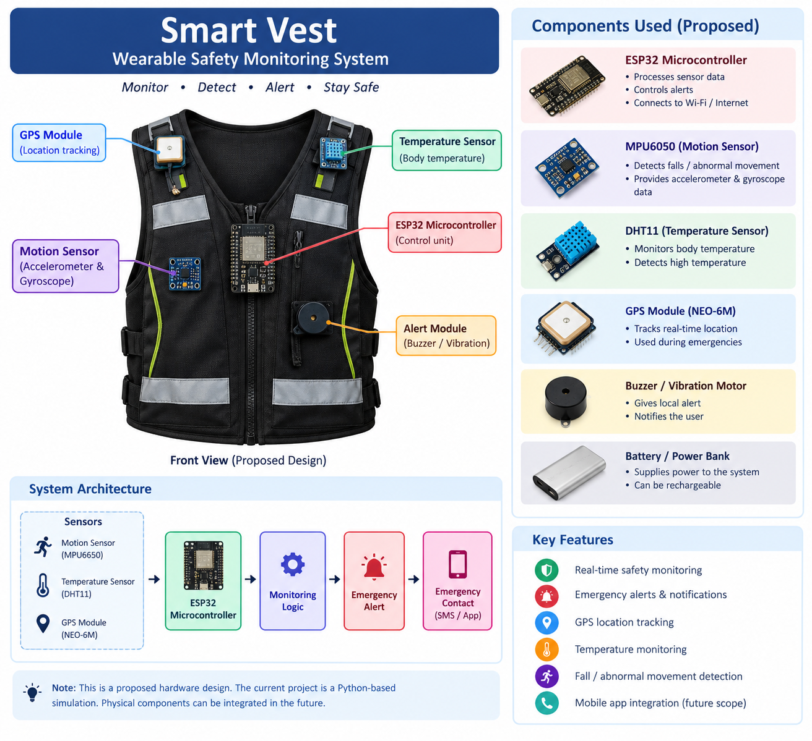
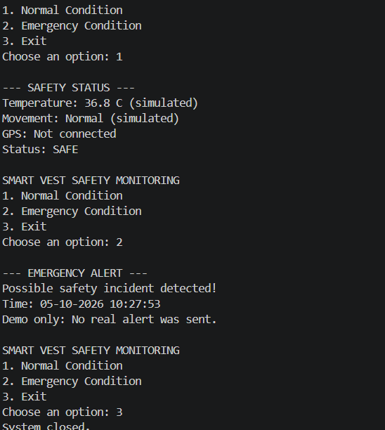

# Smart Vest Safety Monitoring System

## 1. Project Objective

The objective of the Smart Vest project is to develop a wearable safety monitoring system that can help identify unsafe conditions and provide emergency alerts.

The current project is implemented as a Python-based simulation. It demonstrates the monitoring and alert logic without requiring physical hardware components.

## 2. Features

* Safety condition monitoring
* Simulated temperature monitoring
* Simulated movement monitoring
* Emergency alert demonstration
* Date and time recording for emergency events
* Proposed GPS-based location tracking

## 3. Technologies Used

* Python
* VS Code
* GitHub

## 4. Working

The Python program provides three options:

1. Normal Condition
2. Emergency Condition
3. Exit

When the user selects **Normal Condition**, the program displays simulated temperature, movement, GPS status, and a SAFE message.

When the user selects **Emergency Condition**, the program displays an emergency alert and records the current date and time.

## 5. Monitoring and Alert Logic

The current Python program uses conditional statements to determine the system response.

* Normal condition → Display SAFE status.
* Emergency condition → Display emergency alert.
* Invalid input → Display an error message.
* Exit → Stop the program.

The current readings are simulated because physical sensors are not connected.

## 6. Proposed Hardware

The future physical version can use:

* ESP32 microcontroller
* MPU6050 accelerometer and gyroscope
* Temperature sensor
* GPS module
* Communication module
* Battery

The proposed system flow is:

**Sensors → ESP32 → Monitoring Logic → Emergency Alert → Emergency Contact**

## 7. Current Limitation

The current implementation is a software prototype.

It does not currently:

* Read real sensor data
* Detect real falls
* Track real GPS location
* Send real emergency messages
* Use physical hardware

## 8. Future Scope

The project can be extended by connecting actual sensors to an ESP32 microcontroller.

### Motion Detection

An MPU6050 sensor can be used to collect acceleration and gyroscope readings. These readings can be processed to identify possible falls or abnormal movements.

### Temperature Monitoring

A temperature sensor can be connected to the microcontroller to collect temperature readings.

### GPS Tracking

A GPS module can provide the user's location during an emergency.

### Emergency Notification

A suitable communication module or internet connection can be used to send an emergency notification containing the detected event and location.

### Mobile Application

A mobile application can be developed to display the user's safety status and emergency information.

## 9. Expected Output

The current Python prototype displays:

* Normal safety status
* Simulated sensor information
* Emergency alert
* Date and time of the emergency event

## 10. Conclusion

The Smart Vest project demonstrates the basic concept of a wearable safety monitoring system using Python simulation.

The current prototype provides the monitoring and alert logic, while future development can integrate physical sensors, GPS, communication modules, and a mobile application to create a complete IoT-based safety system.

## Proposed Hardware Design

The design shows the proposed integration of an ESP32,
motion sensor, temperature sensor, GPS module, alert module,
and power supply. These components are planned for future
hardware implementation.

## Project Output

### Normal Condition and Emergency Alert

The above output demonstrates the Python-based simulation of
normal safety monitoring and emergency alert conditions.